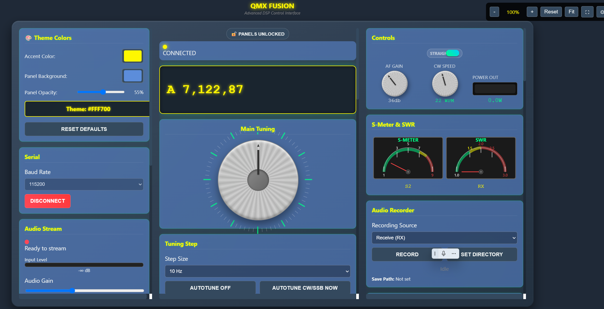
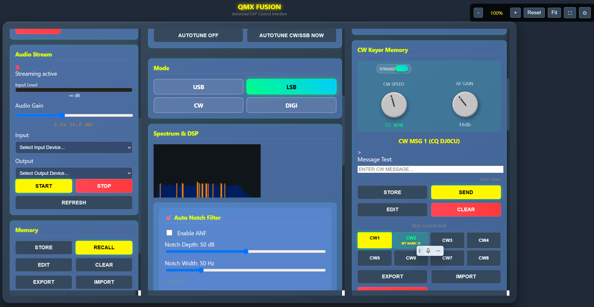
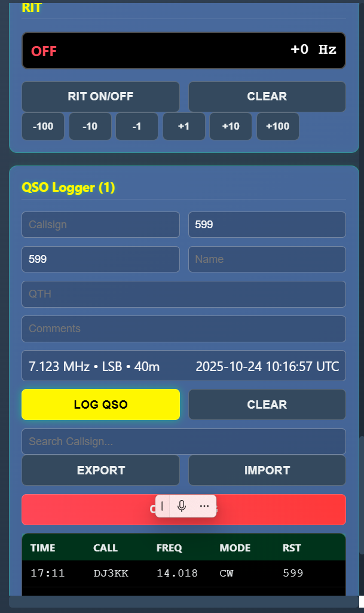

# QMX Fusion

A web-based control interface for QMX QRP transceivers with integrated DSP audio processing.

## Overview

QMX Fusion provides browser-based control for QMX transceivers through a WebSerial connection. The interface includes real-time spectrum analysis, digital signal processing filters, and various operating aids for CW and SSB modes.

## Screenshots

## 🌐 Live D

**[► Launch Live Demo](https://sparks72.github.io/QMX-Interface/qmx-fusion-v1/)**

*Try the interface directly in your browser - no installation required!*

## Features

### Rig Control
- Full CAT command integration via WebSerial
- Frequency control with multiple tuning rates
- Band and mode switching
- Memory channel management
- S-meter and SWR monitoring

### Digital Signal Processing
- **CW DSP Filter**: Adjustable bandwidth (50-500 Hz) centered on CW pitch
- **SSB DSP Filter**: Configurable high/low pass filtering with preset options
- **Auto Notch Filter**: Automatic detection and removal of interfering carriers
- Multi-stage AGC for both CW and SSB

### Audio Features
- Real-time FFT spectrum analyzer with waterfall display
- Audio input/output device selection
- Voice keyer with 8 programmable message slots
- CW keyer with message memory
- Audio recording and playback
- Adjustable audio gain and attenuation

### Interface
- Drag-and-drop panel organization
- Persistent settings storage
- Clock with automatic time synchronization
- Comprehensive logging (CAT commands and system events)
- Visual frequency display with band indicators

## Requirements

- Modern web browser with WebSerial API support (Chrome, Edge, Opera)
- QMX transceiver with USB connection
- Audio input device for receive audio

## Installation

1. Download `QMX_Fusion.html` from this repository
2. Open the file in a compatible browser
3. No server or installation required - runs entirely in the browser

## Quick Start

1. **Connect Hardware**: 
   - Connect QMX to computer via USB
   - Connect audio output from QMX to computer audio input

2. **Serial Connection**:
   - Click "Connect Serial"
   - Select the QMX COM port
   - Click "Start Device"

3. **Audio Setup**:
   - Click "Refresh" to enumerate audio devices
   - Select input device (QMX audio)
   - Select output device (speakers/headphones)
   - Click "Start Stream"

4. **Operating**:
   - Use the tuning knob or frequency display to change frequency
   - Select mode (CW/USB/LSB)
   - Enable DSP filters as needed
   - Adjust spectrum display settings for optimal visualization

## DSP Filter Usage

### CW DSP
- Enable when operating CW mode
- Select bandwidth based on conditions (wider for weak signals, narrower for QRM)
- Filter automatically centers on CW pitch setting

### SSB DSP
- Use preset buttons for common filter shapes
- Adjust low/high cutoff sliders for custom filtering
- Lower cutoff removes rumble, higher cutoff removes hiss

### Auto Notch
- Enable to automatically detect and remove interfering carriers
- Adjust depth (attenuation amount) and width (bandwidth)
- Display shows detected interference frequencies

## Technical Details

### Browser Compatibility
Requires browsers supporting:
- WebSerial API
- Web Audio API
- MediaStream API
- ES6 JavaScript

### Audio Processing
- Sample rate: 48 kHz
- FFT size: 2048 (adjustable)
- Filter implementation: Biquad IIR filters
- Latency: ~50-100ms depending on browser

### Serial Communication
- Baud rate: 115200
- Protocol: QMX CAT commands
- Connection: WebSerial API

## Known Limitations

- WebSerial API not available in Firefox or Safari
- Audio routing requires manual cable connection (no internal audio routing)
- Some features require audio streaming to be active before enabling

## File Structure

Single HTML file containing:
- HTML structure and UI elements
- CSS styling
- JavaScript application logic
- No external dependencies except CDN-hosted SortableJS

## Contributing

This is a personal project, but suggestions and bug reports are welcome through GitHub issues.

## License

[Choose appropriate license - e.g., MIT, GPL, etc.]

## Credits

Developed for the QMX transceiver by QRP Labs.

## Version History

### v1.0 - QMX Fusion Release
- Initial release with full DSP suite
- CW/SSB filtering
- Auto Notch Filter
- Spectrum analyzer
- Voice/CW keyer integration

---

**Note**: This software is provided as-is. Always verify proper operation before on-air use.

